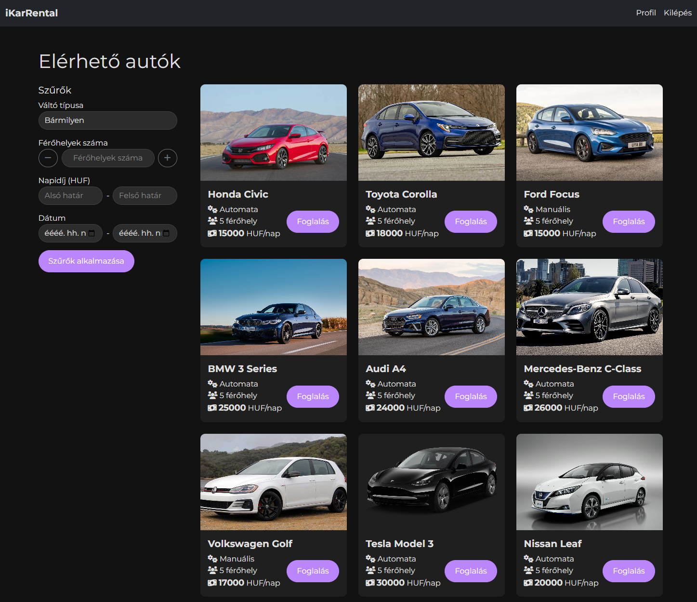
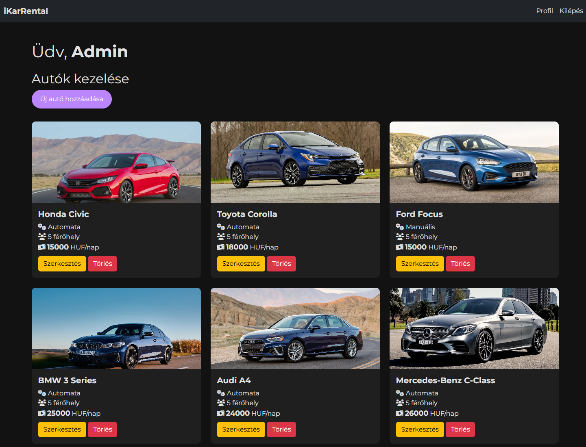

# 🚗 iKarRental - Car Rental Management System

A PHP-based car rental management system developed as a **university assignment**. The system features both user and administrative functionalities, allowing customers to rent cars and administrators to manage the fleet.

## 🚀 Features

### User Features
- **Browse Cars**: View available cars with detailed information and photos.
- **Advanced Filtering**: Filter cars by transmission type, passenger capacity, price range, and availability.
- **Car Booking**: Reserve cars for specific date ranges with calendar integration.
- **User Dashboard**: Track and manage personal bookings.
- **User Authentication**: Secure registration and login system.

### Admin Features
- **Fleet Management**: Add, edit, and remove cars from the system.
- **Booking Administration**: View and manage all customer bookings.
- **Image Handling**: Upload and manage car images.
- **Vehicle Details**: Maintain comprehensive vehicle information including:
  - Brand and model
  - Year of manufacture
  - Transmission type
  - Fuel type
  - Passenger capacity
  - Daily rental price

## 💻 Technologies
- PHP
- JSON (for data storage)
- Bootstrap 5
- JavaScript
- FullCalendar.js
- Font Awesome

## 📸 Screenshots

## 🔑 Admin Access

Default admin credentials:

- **Email**: admin@ikarrental.hu
- **Password**: admin

## 📋 Project Details

- **University**: ELTE
- **Year**: 2024

---

⭐ This was a university project and is not actively maintained.
